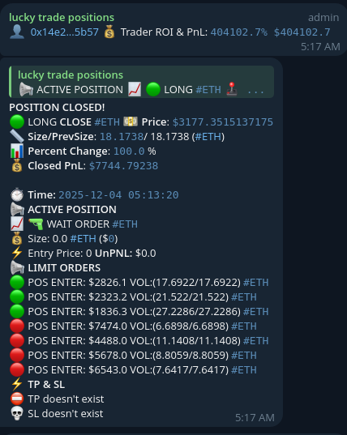

# Hyperliquid Wallet Monitor in Telegram

A Python-based Telegram bot that monitors top-performing traders on the [Hyperliquid](https://hyperliquid.xyz) exchange and sends real-time notifications about their trading activities, positions, and fills.

## Features

- **Leaderboard Monitoring**: Fetches top traders from Hyperliquid's leaderboard based on PnL and ROI filters
- **Real-time Position Tracking**: Monitors active positions, limit orders, TP/SL levels
- **Fill Event Notifications**: Sends alerts when traders open/close positions
- **Telegram Integration**: All notifications delivered via Telegram bot with rich formatting
- **Interactive Commands**: Control the bot via Telegram commands
- **Long/Short Analysis**: View market sentiment with aggregated long/short ratios

## Installation

1. Clone the repository:
```bash
git clone https://github.com/Emile1154/hyperliquid-telegram-bot.git
cd hyperliquid-telegram-bot
```

2. Install dependencies:
```bash
pip install -r requirements.txt
```

3. Configure the bot:
   - Open `config.json`
   - Set your `TELEGRAM_TOKEN` (get from [@BotFather](https://t.me/BotFather))
   - Set your `CHAT_ID` (group or channel ID for notifications)
   - Adjust filtering thresholds:
     - `PNL_MIN`: Minimum PnL in USD for traders
     - `MIN_ROI`: Minimum ROI percentage
     - `PERIOD`: Timeframe (day/week/month/allTime)
     - `POLL_INTERVAL`: Seconds between position checks

4. Run the bot:
```bash
python main.py
```

## Telegram Commands

| Command | Description | Usage |
|---------|-------------|-------|
| `/help` | Show available commands | `/help` |
| `/refresh` | Update trader list with filters | `/refresh --roi 50 --pnl 10000 --period week` |
| `/active` | Show all active positions | `/active` |
| `/sniper` | Show positions in WAIT status | `/sniper` |
| `/longshort` | Long/Short ratio analysis | `/longshort --range 1` (1=all coins, 2=per coin) |
| `/volume` | BTC vs Altcoins volume | `/volume` |
| `/events` | Big fill events (in development) | `/events` |

### Command Examples

```bash
# Refresh with minimum 100% ROI and $5000 PnL
/refresh --roi 100 --pnl 5000 --period month

# Short form
/refresh -r 100 -p 5000 -t day

# Long/Short for all coins combined
/longshort --range 1

# Long/Short per coin
/longshort -r 2
```

## Configuration

Edit `config.json`:

```json
{
    "credits": {
        "CHAT_ID": "YOUR_CHAT_ID_HERE",
        "TELEGRAM_TOKEN": "YOUR_BOT_TOKEN_HERE"
    },
    "attributes": {
        "MIN_TRADES": 10,   //currently not used
        "POLL_INTERVAL": 50,  
        "MIN_POSITION_SIZE": 15000,
        "MIN_ROI": 100000,
        "PERIOD": "allTime",
        "PNL_MIN": 15000
    }
}
```

### Parameters

| Parameter | Description | Default |
|-----------|-------------|---------|
| `CHAT_ID` | Telegram chat/group ID | - |
| `TELEGRAM_TOKEN` | Bot token from @BotFather | - |
| `POLL_INTERVAL` | Seconds between API checks | 50 |
| `PNL_MIN` | Minimum trader PnL (USD) | 15000 |
| `MIN_ROI` | Minimum trader ROI (%) | 100000 |
| `PERIOD` | Leaderboard timeframe | allTime |
| `MIN_POSITION_SIZE` | Minimum position size filter | 15000 |

## Notification Format

The bot sends formatted messages including:

- **Trader Info**: Name, wallet address (linked to explorer), PnL, ROI
- **Position Details**: Direction (LONG/SHORT), size, entry price, leverage
- **Limit Orders**: Entry/exit orders with prices and volumes
- **TP/SL Levels**: Take profit and stop loss orders
- **Fill Events**: Real-time updates on position changes

### Example:




## APIs Used

- **Hyperliquid Info API**: `https://api.hyperliquid.xyz/info` - Positions, fills, orders
- **Hyperliquid Stats API**: `https://stats-data.hyperliquid.xyz/Mainnet` - Leaderboard data

## License

MIT License

## Disclaimer

This bot is for educational and monitoring purposes only. Trading carries significant risk. Always do your own research before making investment decisions.
